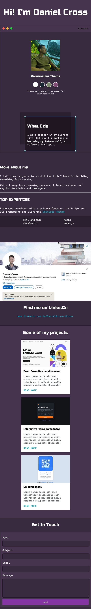

# My Portfolio
---
## Overview 

This is a demo portfolio which I am currently working on and perfecting. I used this tutorial to relearn some of the development concepts whihc needed refreshing. This tutorial was put together by [Denis Ivy & Traversy Media](https://www.youtube.com/watch?v=r_hYR53r61M&list=PLiZVeIaCmKCkFdiu2N53U0CdmSTEJkkwA&index=18&t=5624s)

---

## Table of Contents
- My Process
- Build with
- Screenshots
- Useful Resources and Links
- What I Learned
- Acknowledgements

---

### My Process 

- The process for putting this portfolio together followed a very specific workflow. First complete one small section with HTML and then style the section. Once each section was complete, I moved onto the next section. 
- The initial CSS file was compiled with variables in the beginning. This made it easy to adjust color schemes for various themes. 
- JavaScript was included at the end. This didn't follow a test first implementation of code as the DOM manipulation was simple. 
- My Process is not complete as I need to complete the blog posts and paragraphs for each of my project sections and I need to update my resume and LinkedIn page. 

---

### Built With

- Semantic HTML markup
- responisve CSS 
- Flexbox and CSS grid 
- Vanilla JavaScript

---

### Screenshots 

**White Theme or origional page**

**Purple Mobile Responsive Theme**

**Green Theme**

**Blue Theme**

---

